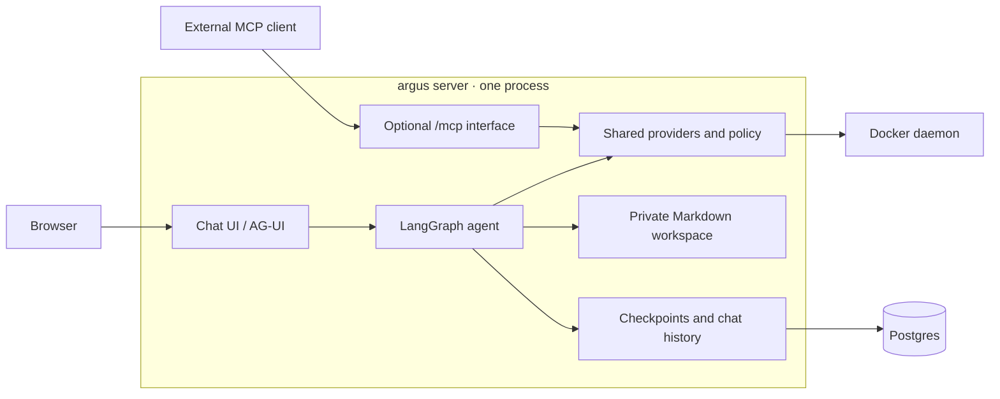

<p align="center">
  
</p>

<h1 align="center">Argus</h1>

<p align="center">
  <a href="https://github.com/tsdaemon/argus/blob/main/LICENSE"></a>
  
  <a href="https://langchain-ai.github.io/langgraph/"></a>
  <a href="https://gofastmcp.com"></a>
  <a href="https://github.com/astral-sh/ruff"></a>
</p>

A self-hosted [LangGraph](https://langchain-ai.github.io/langgraph/) agent for operating home
infrastructure through constrained tools. One agent process serves the chat UI, conversation
history, and an optional policy-gated MCP interface for external clients.

The name follows a small mythological vocabulary from the design behind this project:
**Theseus** is the underlying system being operated on (in the reference deployment: a home
NAS, [tsdaemon/theseus](https://github.com/tsdaemon/theseus)); **Hermes** is whatever *other*
agent runtime might call in over MCP (a scheduled
[Hermes Agent](https://github.com/NousResearch/hermes-agent) run, Claude Code, or anything else
that speaks MCP); **Argus** — the hundred-eyed watcher — is this agent, the one thing standing
between any caller and anything that actually changes state.

See [`docs/DESIGN.md`](docs/DESIGN.md) for the full architecture and
[`docs/argus-agent-v0.md`](docs/argus-agent-v0.md) for current build status.
For the first real-model/container run, follow the [live test plan](docs/LIVE_TEST_PLAN.md).
For traces, cost, and the patched Phoenix image, see [`docs/tracing.md`](docs/tracing.md).

## Why not just give the agent SSH?

Because then the security boundary is "hope the model doesn't do anything stupid." Argus makes
it deterministic instead:

- Every tool a provider exposes is classified **READ**, **MUTATE**, or **DESTRUCTIVE**.
- **READ** tools are always available.
- **MUTATE** tools only run after a real approval round-trip — the gate lives in Argus's code,
  not in the model choosing to ask first. See [Approval](#approval), below.
- **DESTRUCTIVE** tools are, by default, never even registered — they don't exist in the tool
  list an agent sees, not just refused when called.
- **Break-glass** exists for when the agent genuinely can't resolve something with the tools it
  has — a human-reviewed escalation to a real, unconstrained Claude Code session. See
  [Break-glass](#break-glass), below.

None of this is specific to any one backend. This classification/approval boundary (`PolicyEngine`
+ `ApprovalBackend`) has no idea what Docker or Theseus are — it only knows how to classify and
gate. What actually gets exposed is decided per deployment, in a config file — and the exact same
tool implementations are bound both to Argus's own agent loop *and* to MCP for external clients,
never two separate implementations. See [`docs/DESIGN.md`](docs/DESIGN.md#tool-binding-architecture).



## Quickstart

Requires Python 3.11+, uv, Node 24, Docker Compose, and go-task. Run Argus locally;
Compose runs Postgres, Phoenix, and three disposable Docker test containers.

```bash
# If .env does not exist yet:
cp .env.example .env   # set POSTGRES_PASSWORD and OPENROUTER_API_KEY

task install
task deps:up
task backend:migrate
task frontend:build
task backend:dev
```

`task backend:dev` runs `uvicorn argus.api.app:create_app --factory --reload` on your machine, with
`ARGUS_CONFIG=examples/argus.dev.yaml` (set in the Taskfile). It loads `.env`, supplies the local
Postgres URL, and restarts when `src/` or the config changes. Edit that file to change local settings.

The agent's workspace is **`.argus/workspace/`** in this checkout. Open that directory
in your editor to watch Markdown memory, notes, and skills change as tools write them.
Files persist across process restarts; chat history and checkpoints live in Postgres.
The default local config lets Docker tools access `argus-live-a` and `argus-live-b`;
`argus-live-hidden` tests that the allowlist blocks other containers.

Open **http://127.0.0.1:8421/** for chat, streamed tool activity, approval controls,
and saved conversations. Chat messages and the conversation list live in Postgres;
reloading or reopening a chat restores its messages and pending approvals. Earlier
messages remain in history when the agent summarizes its working context.

For UI development, run `task frontend:dev` alongside `task backend:dev`; Vite proxies
the API to port 8421. To manage both in one terminal with [mprocs](https://github.com/pvolok/mprocs),
use [`mprocs.yaml`](mprocs.yaml):

```bash
task dev
```

This starts the Compose dependencies (`up -d --wait`), applies migrations, then runs
`mprocs` with two processes, `agent` (the same `uvicorn` command as `task backend:dev`) and
`frontend` (Vite),
supplying the local database URL and loading `.env`.

Open **http://127.0.0.1:5173/** for Vite's live-reloading frontend; no frontend build is
needed for this workflow. The agent restarts by itself when a file under `src/` or
`examples/argus.dev.yaml` changes (`uvicorn --reload`); select it and press `r` to restart
it by hand. Press `q` to quit mprocs, which stops both processes; Compose dependencies stay running
(`task deps:down` stops them).
The workspace remains in `.argus/workspace` on the host.

The production build needs no Node server. Apply `task backend:migrate` when upgrading an
existing database, including the conversation-history migration.

`OPENROUTER_API_KEY` ([openrouter.ai/keys](https://openrouter.ai/keys)) is the one model
credential Argus needs — it routes to any upstream model (Anthropic, OpenAI, Google, ...) you
name in `agent.model` in your config, no code change to switch. See
[Configuration](#configuration).

The whole app sits behind one admin login: the first visit to `/login` creates the account and
shows a generated password once (see [Login](#login)). If a `breakglass` provider + launcher
are configured, `/breakglass` is behind the same login (see [Break-glass](#break-glass)).

## Running it

A [Taskfile](Taskfile.yaml) wraps the common commands (`task --list` for the full set):

```bash
task install           # Python and frontend dependencies
task test              # pytest + Playwright (Chromium; no database needed)
task backend:test      # pytest only
task lint              # ruff
task deps:up           # Postgres, Phoenix, and canaries in Compose
task backend:migrate           # explicit Argus history schema migrations
task dev               # dependencies + migrations, then local Argus and Vite via mprocs
task backend:dev       # local agent, UI, history, and optional MCP on :8421
task frontend:dev      # Vite development server, proxying the local agent API
task frontend:build    # build the UI for the Python process
task deps:down         # stop dependencies/canaries, preserving data
```

**`uvicorn argus.api.app:create_app --factory` is the only server command** (`ARGUS_CONFIG`
names its config). Set `ARGUS_MCP_TOKEN` in `.env` and
restart that process to expose `/mcp` on the same port. Its agent, UI, and history
remain available alongside MCP. Break-glass web routes are included when the
`breakglass` provider is configured.

**Docker deployment** uses the same application and command. The `app` Compose profile
opts into running Argus in a container; ordinary local development leaves it on the host.
The image includes the built CopilotKit frontend. To deploy the container locally:

```bash
docker compose up -d --wait postgres
docker compose build argus
docker compose run --rm --no-deps --entrypoint alembic argus upgrade head
task docker:up         # enables the app profile
task docker:logs
```

`CONFIG_FILE` selects the container's config (default `examples/argus.example.yaml`).
Named volumes persist its workspace and break-glass store. `ARGUS_PORT` selects its
published port, default 8421. Use either this container or the local `task backend:dev` on
that port. The Docker socket supplies the provider; `allowed_containers` in the config
scopes its operations. A read-only socket bind does not restrict Docker API calls.

### Login

The UI, the chat and history API, `/agent`, and the break-glass pages all require the admin
login, a signed session cookie behind one account (`admin`). Three things stay open: `/login`,
`/agent/health`, and `/mcp`, which external clients reach with `ARGUS_MCP_TOKEN` instead of a
browser. Without a session a page request is redirected to `/login`, and an API call gets 401.

The first visit to `/login` creates the account. Set `ARGUS_ADMIN_PASSWORD` to choose its
password (do this for any deployment, so a stranger reaching a fresh instance cannot pick it);
otherwise one is generated and shown once. The variable only seeds the account. To rotate the
password, delete the row (`delete from admin_account`) and visit `/login` again. There is no
rate limiting, so keep the app on a LAN, a VPN, or behind a tunnel rather than the open internet.
The privileged-session link opens the `/launch` page under the same login.

Browser integration tests use in-memory history and checkpoint stores, the real Python
graph/API, and a fake model/Docker client, so they need no database. After building the UI,
run `cd frontend && npx playwright install chromium && npm test`.

**Deploying to theseus** (or any specific host) follows the
[homelab-compose-deploy](https://github.com/tsdaemon/theseus) two-file overlay pattern: a
`docker-compose.deploy.yml` adds Traefik/Homepage labels and host-specific env on top of the
generic base file. That overlay — and the `.env.deploy` it reads from — are **gitignored**,
deliberately: they're one person's real hostnames and label wiring, not something a generic OSS
repo should carry. Copy the committed templates to get started:

```bash
cp docker-compose.deploy.yml.example docker-compose.deploy.yml   # then fill in the placeholders
cp .env.deploy.example .env.deploy
task deploy         # docker --context theseus compose --profile app -f docker-compose.yml -f docker-compose.deploy.yml up -d --build
task deploy:logs
```

## Configuration

See [`examples/argus.example.yaml`](examples/argus.example.yaml) for every knob, annotated, and
[`examples/theseus.argus.yaml`](examples/theseus.argus.yaml) for a real deployment's shape. In
short:

- `providers:` enables and configures shared operational backends (currently: `docker`,
  `breakglass`).
- `policy:` sets the class defaults (`default_mutate`, `default_destructive`) and any per-tool
  `overrides:` keyed `"<provider>.<tool_name>"` — enforced identically whether a tool is reached
  through the agent or through `/mcp`.
- `agent:` configures the LangGraph harness: `workspace_root` (the agent's private Markdown
  memory + skills), `database_url` (Postgres, checkpoints + history), `model` (an OpenRouter
  `<provider>/<model>` id, e.g. `google/gemini-3.7-flash`), `api_key`
  (`${OPENROUTER_API_KEY}`), and `otel:` (Phoenix tracing via `enabled`, `endpoint`, and `project_name`; off by default).

`${ENV_VAR}` in any config value is expanded from the environment at load time, so tokens and
API keys never need to be committed.

## Providers shipped in v1

- **`docker`** — container visibility (`list_containers`, `get_container_status`,
  `get_container_logs`, `inspect_container`) and `restart_container`, optionally scoped to an
  `allowed_containers` list.
- **`breakglass`** — `request_break_glass` (available to the agent and through the MCP interface; it only
  records a request, see [`docs/DESIGN.md`](docs/DESIGN.md#trust-boundaries)), plus the Postgres-backed request store behind the `/breakglass` web view.

**Roadmap** (same `Provider` shape, not built yet — see [Adding a provider](#adding-a-provider)):
`systemd` (unit status, journal logs, restart unit), `disk`/SMART (health, storage usage),
`network` (ping/probe a host).

Also planned, but deliberately **not** a `Provider`/`/mcp` tool: read access to the
user's Notion "Digital Home" inventory as a native knowledge source for the agent (see
[`docs/DESIGN.md`](docs/DESIGN.md#trust-boundaries)) — read-only reference material,
grouped with the agent's own memory/workspace rather than with MCP-facing operational
tools, so no external MCP client gets to read it just because it can call `docker.*`.

## Approval

A tool classified `MUTATE` is gated the same way — `PolicyEngine.decide()` — no matter which
interface it's reached through, but the actual human round-trip differs by interface:

- **Through the agent** (`/agent`): LangGraph's own `interrupt()`, surfaced to the React
  frontend in the native AG-UI `RUN_FINISHED` interrupt outcome. The frontend answers
  through `resume[]`, matching each approval to its interrupt ID. Cancellation rejects
  the pending actions. See the [approval contract](docs/DESIGN.md#permissionshitl).
- **Through `/mcp`**: [FastMCP](https://gofastmcp.com)'s real elicitation primitive
  (`ctx.elicit()`) — a blocking round-trip to the connected MCP client, awaited *inside the tool
  handler itself* before it does anything. The model cannot skip this the way it could skip an
  advisory "please call this confirmation tool first" convention. Failed or unsupported
  elicitation refuses the action. Real Hermes elicitation remains unverified.

The `ApprovalBackend` interface (`src/argus/approval/__init__.py`) is deliberately narrow and
optional — the agent's own `PolicyEngine` instance needs none at all, since it only ever calls
`.decide()`, never the MCP-specific `.register()` gate.

## Break-glass

`request_break_glass(reason, target_host, evidence, proposed_objective)` exists for when the
agent genuinely can't resolve something with the READ/MUTATE tools it has. It's classified
READ — it cannot mutate anything, only record that a human needs to look. There is no tool
anywhere — MCP or agent-native — that approves or executes one; it's a deliberate human-only
escalation, kept off the agent's own tool list entirely (see
[`docs/DESIGN.md`](docs/DESIGN.md#trust-boundaries)).

Break-glass is specifically for *unattended* runs — a scheduled check with nobody watching. (If
a human is live in the Argus Agent UI, they'd just answer the HITL approval prompt on a MUTATE
tool directly.) That means the approval channel can't assume a terminal or SSH session either —
it needs to work from a phone with nothing installed beyond a browser:

1. A pending request writes a row to Postgres and fires a best-effort push (v1: via
   [ntfy](https://ntfy.sh) — no account, no API key, one HTTP POST to a topic URL you pick).
2. The push links straight into a minimal, plain-HTML, no-JS approval page served at
   `/breakglass` on the same server process. No token to configure or embed in a
   URL: it uses the app's admin login (see [Login](#login)). Log in, see the
   reason/evidence/target, tap Approve or Deny.
3. If a `launcher` is configured (see below), **approving also starts a Claude Code session on
   the host**, seeded with that request's reason/evidence/objective. If no launcher is
   configured, approving only flips the request's status — nothing opens on your behalf.

The same `/launch` page is also where the Argus Agent React UI's own break-glass button sends
you — one implementation, not two.

### Session launch (optional)

The one thing worth being deliberate about: everything else in Argus is scoped to a small,
specific, classified action. "Start a privileged, largely unrestricted Claude Code session" is
categorically bigger than any of that. So the launcher is opt-in, kept entirely off both the MCP
surface and the agent's own tool list (no agent ever triggers it; an agent can only file a
request — only the human-facing
`/breakglass` and `/launch` web routes do), and the security boundary lives on the machine that
actually runs the session, not in Argus's code:

```
approve (or /launch)  ──HTTP, logged in as admin──▶  argus server
                                                              │
                                                              │ ssh, forced command
                                                              ▼
                                                    argus-breakglass-launch (on the host)
                                                              │
                                                              ├── writes CONTEXT.md
                                                              └── starts, detached:
                                                                  timeout <ttl> claude remote-control
                                                                      --permission-mode <mode>
```

Argus only ever sends a session label and free text over that SSH connection — never anything
that changes what gets launched or with what permissions. `permission_mode` and `ttl_seconds`
come from *this deployment's config* (the `launcher:` block), never from a break-glass
request's fields, so an agent's `request_break_glass` call can influence what a human reads,
never how the resulting session is scoped.

**Set up each host once.** The host side (a dedicated user, the launcher script, a
forced-command SSH key, and `claude` installed) is provisioned by the `breakglass` role in
[autohome](https://github.com/tsdaemon/autohome). The one step no tool can do is
`claude auth login` as that user, which needs a browser. See
[`docs/breakglass.md`](docs/breakglass.md) for the flow, the trust model, and the payload
contract between this service and the host script.

The forced-command restriction on the host is the actual security boundary: even if the private
key leaked out of Argus's container, it can *only* ever run that one fixed script — nothing else,
no shell, no port forwarding. Mount the private key into wherever the argus server runs, then
name each host:

```yaml
breakglass:
  launcher:
    type: ssh
    identity_file: /run/secrets/argus_launcher_key
    permission_mode: manual        # manual | acceptEdits | dontAsk | auto
    ttl_seconds: 900               # session is killed after this regardless; omit to disable
    hosts:
      theseus:
        host: 192.168.0.7
        user: argus-bg
```

The approve button and the `/launch` page both ask which of these hosts to launch on.

A launched session doesn't stream anywhere — you open it from your own Claude app once it's
running (Remote Control is outbound-only and tied to your account, so it just shows up there;
Argus never captures or relays a session URL). And because the context written to `CONTEXT.md`
is exactly whatever an agent's break-glass request or your own manual `/launch` input said,
it's labeled there as something to review, not follow blindly — this is the one place in the
whole system where agent-supplied text becomes input to a *more* capable, less constrained
session than the one that produced it.

## Adding a provider

A provider is a class with a `name` and a `tool_specs(config) -> list[ToolSpec]` method
(`src/argus/providers/base.py`) — the transport-agnostic classification + implementation. A
`register(mcp, policy, config)` method binds those specs onto the MCP interface (usually just
`mcp_bind(mcp, policy, self.tool_specs(config))`); the agent binds the exact same specs directly
via `argus.agent.tools.langchain_bind`. Add one line to `PROVIDER_REGISTRY` in
`src/argus/providers/registry.py`, and it's configurable the same way `docker`/`breakglass` are.
No changes to the policy engine, approval backend, the agent graph, or any other provider are
needed. See [`docs/DESIGN.md`](docs/DESIGN.md#tool-binding-architecture) for the full picture.

## Development

```bash
uv sync --extra dev
uv run pytest
uv run ruff check src tests
uv run pre-commit install   # once, per clone — runs the same lint + basic hygiene checks on every commit
```

The suite runs without a real Postgres or a live MCP/model client: the Docker SDK, approval
backend, and chat models are faked, and routes depend on the `HistoryRepository` interface
(`argus.db.history`) with an in-memory fake in `tests/fakes.py`. The tests in `tests/db/` run
the same contract suite against the fake and against `SqlHistory` on a real Postgres. They
create a throwaway schema, build it with `alembic upgrade head`, and skip (not fail) when
`ARGUS_TEST_DATABASE_URL` is unreachable; run `task deps:postgres` and set it to include them.
