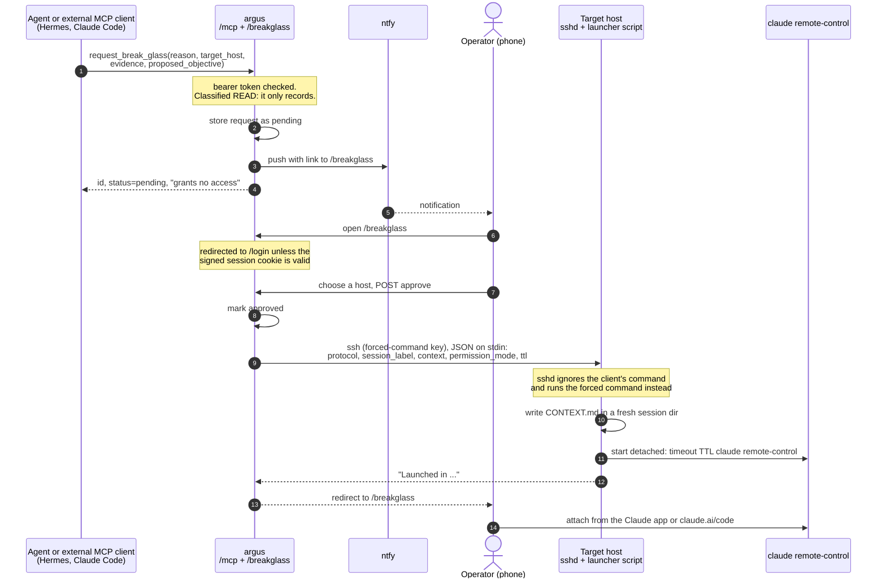
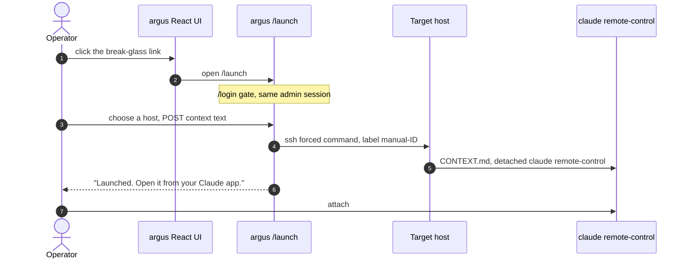
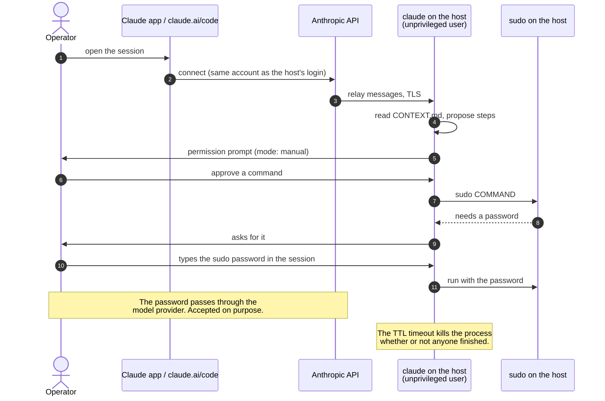
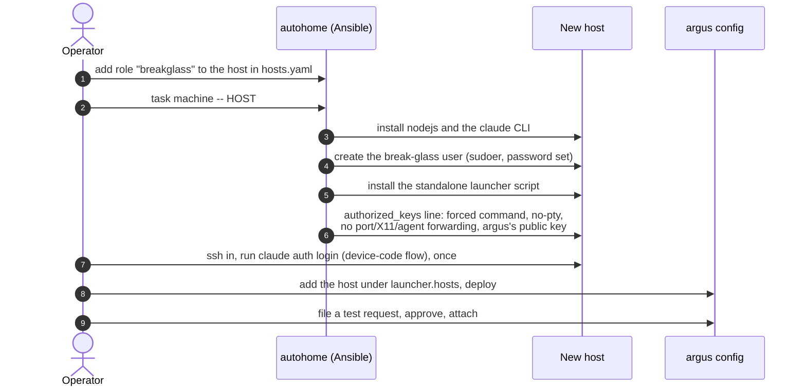

# Break-glass

Break-glass is the one deliberate hole in argus's constraints. When the agent and its
policy-gated tools are not enough, a human can start a real, unconstrained Claude Code
session on the machine that needs attention, seeded with what the agent already knows.

It sits outside both trust boundaries in [DESIGN.md](DESIGN.md#trust-boundaries): the agent
cannot approve or launch anything. It can only ask a human, and the human decides.

Status: the flows below are built, the launcher takes any number of named hosts, and the host
side is installed by autohome. Build status lives in the [ledger](argus-agent-v0.md).

## The idea in one paragraph

`argus` never holds a privileged credential. What it holds is an SSH key that can do exactly
one thing on a target host: run a launcher script that starts `claude remote-control` as an
unprivileged user. A human then attaches to that session from their own Claude account and
does the privileged work there. Root needs the human to type the sudo password into that
session; nothing in argus, the request, or the SSH key can supply it.

## Parts

| Part | Where | Code |
|---|---|---|
| `request_break_glass` tool: files a request, cannot grant anything | argus, bound to the agent and to `/mcp` | `providers/breakglass_provider.py` |
| Request store and admin account, in Postgres | argus | `db/breakglass.py`, `webauth.py` |
| Web view: `/login`, `/breakglass`, `/launch` | argus, the same process as the API | `mcp/webapp.py` |
| Push notification (ntfy) with a link to the approval page | argus | `notify/` |
| `SshHostLauncher`: runs `ssh` to one of the named hosts | argus | `launcher/ssh.py` |
| Forced-command launcher script | **target host**, installed by autohome's `breakglass` role | `argus-breakglass-launch` in the autohome repo |
| `claude` CLI, logged in to the operator's account | **target host** | not argus code |

Only the last two live on the target host. Everything else is one argus deployment.

## Flow 1: an agent asks, a human approves

Points that matter:

- Step 1 is the only thing an agent or external client can do. Neither the agent's tools nor
  `/mcp` approve, deny, or launch.
- Permission mode and TTL come from argus's deployment config (`launcher:` block), never from
  request fields. A request influences what a human reads, not how the session is scoped.
- `CONTEXT.md` is labeled as material to review, not instructions. This is the one place where
  agent-supplied text becomes input to a more capable session than the one that wrote it, so
  the human should read it as untrusted.
- If the SSH step fails after approval, the request stays approved and the page reports the
  error; the human can start a session another way.
- Approving without a configured launcher only marks intent.

## Flow 2: manual launch, no request

## Flow 3: working in the session, and root

The password path is a decision, not an accident: no `NOPASSWD` on any host, the password is
typed by the human, and it is never stored or logged by argus. The cost is that it reaches the
model provider, which the operator accepts. Two things to verify on a real host before
relying on this:

- `sudo` wants a tty and Claude's shell tool has none. It will probably need `sudo -S` or an
  askpass helper, which puts the password in a command and the transcript.
- The session user must be a sudoer with a password set, or there is no root path at all.

## Flow 4: onboarding a host

The transport stays SSH: no new daemon and no new listening port on any machine. sshd already
provides authentication, key restriction, and logging, and a daemon that can start root-capable
sessions would be the highest-value target on the network.

Decisions and their reasons:

- **One login per host, no copied credentials.** Remote Control needs a full-scope login, so
  `claude setup-token` and API keys cannot be used. Copying one `.credentials.json` around
  risks refresh-token rotation logging hosts out of each other, and a stolen file would expose
  the whole account. Separate logins can be revoked individually.
- **Logins expire.** Claude Code warns three days before a saved login expires, and a Remote
  Control session that outlives its login cannot recover. A host that sits idle for months will
  need a `claude auth login` again; autohome should not pretend to automate that.
- **The launcher lives in autohome**, stdlib only, so a host does not need the argus
  package. It is versioned so autohome can pin it.
- **Multiple hosts.** `launcher.hosts` is a named map, each entry with its own address, user,
  and optional overrides of the shared settings (key, permission mode, TTL, port). The approve
  button and the `/launch` page pick from those names, and the request's `target_host` text
  only preselects a matching one. A launch to a name that is not configured is refused, and
  approving without choosing a host changes nothing.

## The payload contract

argus writes one JSON object to the forced command's stdin; the script in autohome reads it:

| Field | Meaning |
|---|---|
| `protocol` | `1`. The host script refuses any other value. |
| `session_label` | `[A-Za-z0-9_-]{1,64}`, becomes the session directory name. |
| `context_markdown` | Text written to `CONTEXT.md`, treated as untrusted. |
| `permission_mode` | From the host's config entry, never from the request. |
| `ttl_seconds` | From the host's config entry; optional. |

The two repos are tested separately, so this table is the seam; a change to it needs both
sides updated.

## Trust model

| Compromise | What the attacker gets |
|---|---|
| A request, or the agent, prompt-injected | A pending request a human may read and refuse |
| The `/mcp` bearer token | Can file requests; cannot approve or launch |
| The argus process or its SSH key | Can start unprivileged sessions on hosts that trust the key; no root, since sudo needs the password |
| The admin cookie or password | Can approve and launch, same as above |
| A launched session | Whatever the session user can do, plus root if a human types the password |
| A target host's Claude credential | That host's login only; revoke it under the account's sessions |

Layers that keep this honest:

1. The forced-command SSH key: the security boundary is on the target host, not in argus.
2. Human approval through an authenticated route the agent cannot reach.
3. Launch settings fixed in deployment config, not request text.
4. Password-gated sudo on every host, never `NOPASSWD`.
5. A TTL on every session.

Known gaps: with no `ARGUS_ADMIN_PASSWORD` the admin account belongs to whoever opens `/login`
first on a fresh store, so set it for any deployment; the login has no rate limiting. The
whole app, not only these pages, sits behind that login. See the ledger for the rest.

## What the host launcher does for a session

Two first-run prompts would otherwise stop `claude remote-control`, and there is no terminal
on a forced SSH command to answer them. The launcher handles both, so neither is a manual step
per host:

- **Workspace trust.** Claude Code refuses to start in an untrusted directory, and every
  session gets a fresh directory. Before starting, the launcher merges
  `projects["<session dir>"].hasTrustDialogAccepted = true` into the account's
  `~/.claude.json`. The directory holds only `CONTEXT.md`, so there is no project
  configuration for the dialog to guard against. The file is an internal one, not a
  documented interface; recheck it when upgrading Claude Code.
- **"Enable Remote Control? (y/n)".** Asked until accepted once, read from stdin. The launcher
  writes `y` and closes the pipe.

Still manual, once per host: `claude auth login` as the break-glass user. The Ansible run
pauses for it and fails if it did not take.

## Verified on a real host

Run on theseus on 2026-09-20 with the autohome roles: the forced-command key started
`claude remote-control` as `argus-bg`, the process stayed up under `timeout`, and the session
was reachable from the operator's Claude account. The launcher ignores a client-supplied
command. Not yet exercised: launching through argus itself (approve or `/launch`), the ntfy
push, and the sudo path with a password.

Verification for the argus side: `docs/LIVE_TEST_PLAN.md` has a break-glass section. The web
and MCP path was scripted on a scratch server.
